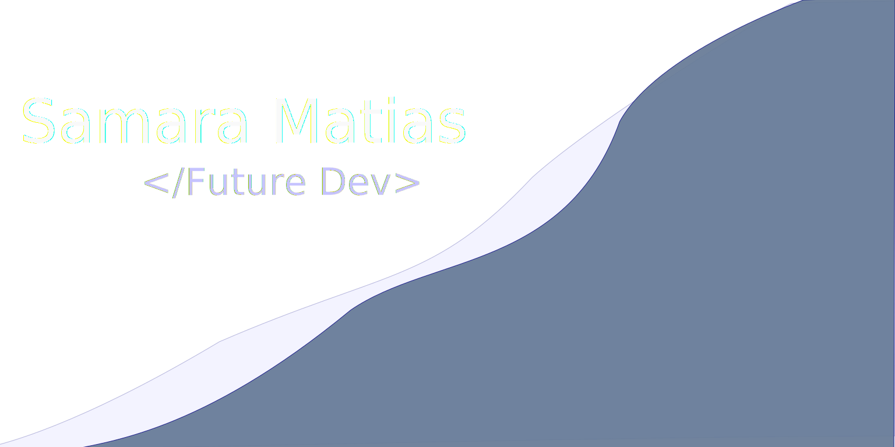

# Hi! I'm Samara 👋
## Welcome to my github profile 😄

#### 🌟 I'm a middle school student and I'm learning programming. 🌟
- ◼️ What I want to be in the future? **A Web and Mobile apps developer**.
---
- 👽 In this profile you'll be able to see my evolution in programming. Check it out!
---
<!-- https://gprm.itsvg.in/ -->
<!-- https://github.com/Ileriayo/markdown-badges?tab=readme-ov-file -->
### 👉 Which markup, database and programming languages I'm learning at this point?
  
  
  
  
  
  

### 👉 Programming languages that I been in touch? (I decided to stop studying them)

 
- (maybe I'll get back studying python in future)
  
---
### 👉 Programming languages or frameworks I want to learn in the future:
   
   
   
    
> [!NOTE]
> I will choose between those languages and frameworks, at least one of each group (Programming language and framework)

---

### 👉 Apps I use for getting inspirations and prototyping my projects:
   
   
   
   
   
---
### 👉 Where I host my sites?
   
   
   
   
---
### 👉 Which plataforms I use/used to study/practice programming?
   
   
   
   

---
<!-- https://github.com/anuraghazra/github-readme-stats?tab=readme-ov-file -->
<!-- https://gprm.itsvg.in/ -->
 

