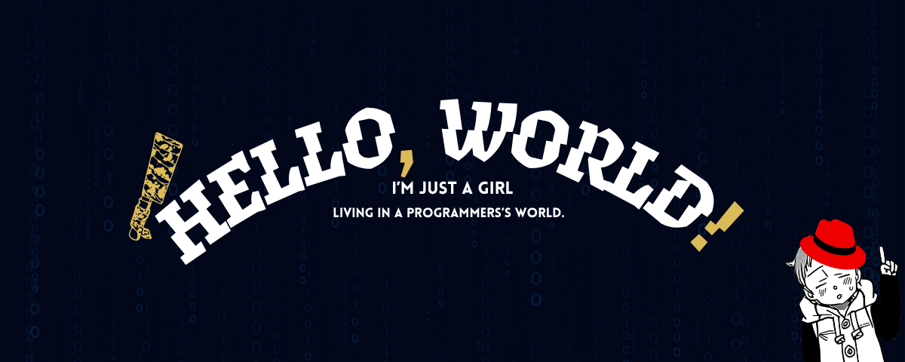

<!-- Banner section -->

## Sobre mim

Olá, chamo-me <b>Samara</b>, prazer em conhecer você! Sou uma <b>programadora iniciante</b> em busca de me desenvolver tanto como pessoa quanto como profissional na área de T.I.

Realizei um Curso Técnico Integrado ao Ensino Médio na instituição pública de educação CEFET/RJ. Foi durante esse período que eu comecei a me interessar e almejar uma carreira na área. Inicialmente eu pretendia seguir como desenvolvedora, mas ultimamente o escopo da cibersegurança tem ma cativado cada vez mais e meus estudos futuros serão focados nessa área, porém o desenvolvimento de softwares ainda estarão presentes em minha vida estudantil e profissional.

Agora encontro-me no primeiro período da faculdade de Sistemas de Informação (S.I) também no CEFET/RJ.

### Tecnologias e Ferramentas

Aqui estão algumas das tecnologias com as quais já tive contato ou utilizo nos meus estudos:

### Linguagens

  
  
  

  

  

  

### Ferramentas

  

  

  

  

---

 

 

